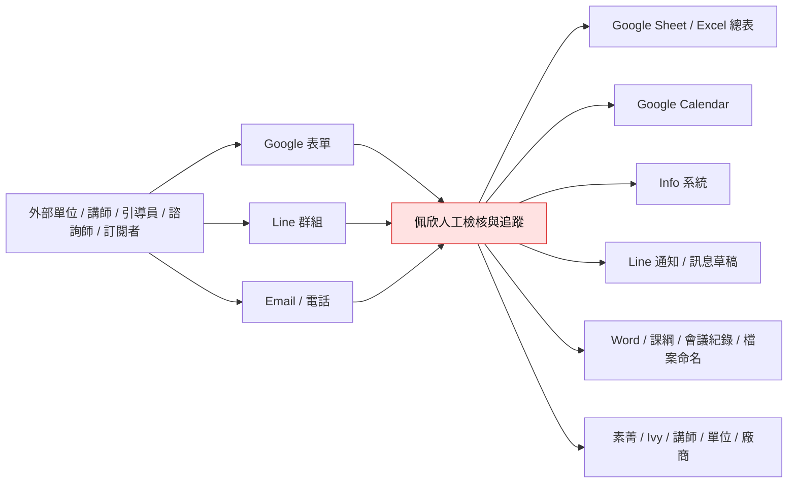
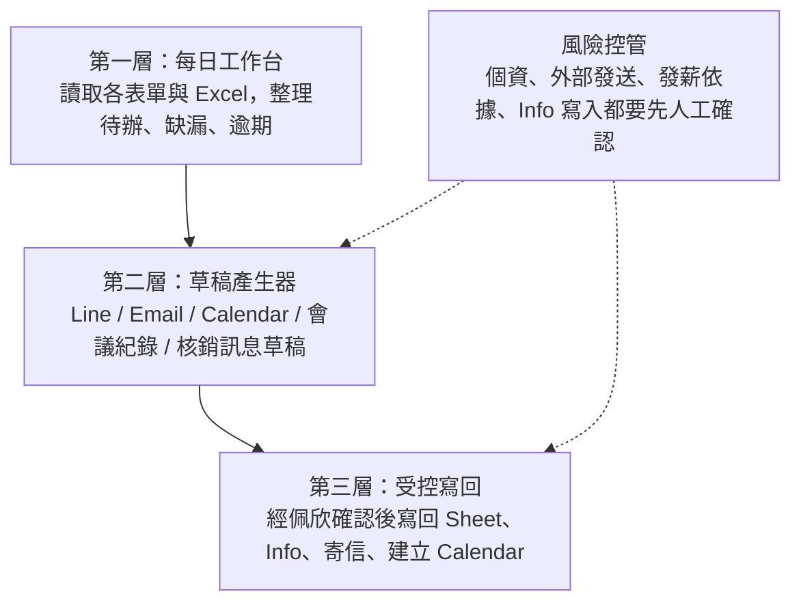
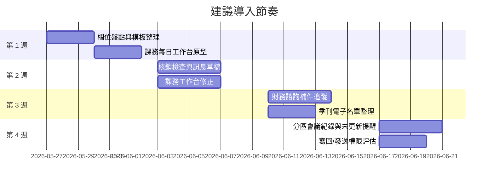

# 佩欣需求分析與 Codex 自動化規劃

日期：2026-05-27  
來源：Kevin 提供的訪談逐字稿與九項工作紀錄  
狀態：需求分析草案，尚未接觸實際表單、Line、Info 或個資資料

補充文件：

- [佩欣九大工作流流程表](./peixin-workflow-flowcharts.md)：記錄課務待確認事項，並把九大工作流整理成逐項討論用流程表。

## 1. 一句話結論

佩欣目前不是單純在「填表」或「提醒人」，而是在多個系統之間扮演人工流程中樞：每天接收表單、檢查資料完整性、轉貼 Line、開行事曆、追課綱與講師資料、核對金額、整理流水帳、通知未完成者、更新 Info、改檔名、維護 Excel 總表。

因此自動化不應該第一步就追求「全自動發送」或「全面取代 Excel」，而應先做一個可審閱的「佩欣工作台」：每天列出待處理、待追蹤、待通知、可直接產生草稿的事項，再逐步開放寫回與發送。

## 2. 可視化需求總覽

佩欣的核心工作可整理成四種反覆動作：

| 動作類型 | 逐字稿中的例子 | 自動化機會 |
| --- | --- | --- |
| 收件與完整性檢查 | 課務申請、財務諮詢轉介、核銷表單、季刊訂閱 | 欄位缺漏偵測、待補清單、通知草稿 |
| 狀態同步 | Google Sheet 記備註、Info 更新、Calendar 建立、Line 群組通知 | 工作台、狀態欄寫回、跨表比對 |
| 到期提醒 | 課綱、簡報、核銷截止、分區會議、諮詢紀錄補件 | 每日/每月 due list、提醒草稿、逾期追蹤 |
| 格式化產物 | Line 固定格式、核銷訊息、課綱外部版、會議紀錄、家系圖檔名 | 模板產生、檔名規則、草稿輸出 |

## 3. 九大工作流拆解

| # | 工作流 | 頻率 | 主要來源 | 主要輸出 | 痛點 | 自動化優先 |
| --- | --- | --- | --- | --- | --- | --- |
| 1 | 課務 / 客戶申請 | 每日 | Google 表單、Line、Email | 內部派課訊息、Calendar、課綱/講師資料追蹤 | 欄位檢查、複製貼上、課綱與簡報 due date 容易散落 | 最高 |
| 2 | 單據核銷 | 月初 / 月底 | 核銷表單、單據、Excel | 金額核對、個別通知、流水帳、扣繳清單 | 分專案篩選、公里數計算、訊息逐則整理 | 最高 |
| 3 | 庫存管理 | 每日或不定期 | 教材表單、Excel | 教材數量、借出單位、歸還狀態 | 借出/未歸還追蹤人工記 | 中 |
| 4 | 季刊訂閱 | 每日或出刊期 | Google 表單、Excel | 電子季刊寄送名單、紙本名單、地址更新 | 表單資料再手動搬到總表、電子版想自動寄 | 中高 |
| 5 | 分區會議 | 兩個月一次 | Excel 登記、會議錄音/逐字稿、Info | 會議提醒、會議紀錄、未更新名單 | 名字校正、個案狀態比對、截圖通知 | 中高 |
| 6 | 財務諮詢紀錄 | 每日 | Info/評論/欄位 | 缺漏提醒、諮詢完成勾選 | 補件拖很久，影響 15 號發薪依據 | 高 |
| 7 | 引導員小老闆日誌 / 郵寄 | 每日 | Google 表單、Info | 寄送日期、完成狀態 | 完成勾選與日期更新重複 | 中 |
| 8 | 粉絲團文章 | 每日 | FB 文章、Info | 建立事件、評論、送審 | 主要是存檔，但每天做很碎 | 中 |
| 9 | 個案轉介與家系圖 | 每日/不定期 | 轉介表單、Line、檔案 | 電訪行事曆、表單時間欄位、家系圖改名 | 個資敏感，檔案命名與時間同步人工 | 中高但需保守 |

## 3.1 佩欣現在的工作流程與優化可能

這段補在痛點之後，是為了讓讀者先看見「她現在到底怎麼做」，再判斷哪些地方值得先優化。

| 工作流 | 她現在的工作流程 | 優化可能 |
| --- | --- | --- |
| 課務 / 客戶申請 | 單位填 Google 表單後，佩欣檢查欄位是否完整；完整就整理成固定格式貼到客戶/內部 Line 群組，等 Ivy 或素菁派講師；講師確認後建立 Google Calendar；後續再追講師資料、課綱、簡報與單位需求。 | 先做「新申請 + 缺漏 + 待派課 + 待開行事曆 + 課綱/簡報 due list」工作台，並產生 Line 草稿。課綱可再加內部版轉外部版模板。 |
| 單據核銷 | 引導員、講師或辦公室成員填核銷表單；佩欣依星展、中信培力、信扶專案、公司課程、辦公室分類篩選；核對公里數、費率、金額與單據；星展還要 key 流水帳與扣繳資料；月底/月初再提醒與逐人回覆核銷金額。 | 先做「核銷檢查器」：依專案分類、套費率、標出金額疑似錯誤與缺件，產生逐人通知草稿。星展流水帳與扣繳清單可做半自動匯入。 |
| 庫存管理 | 佩欣維護一份 Excel，記錄教材/道具數量、借出日期、活動、借出單位、歸還或未歸還狀態。 | 建立庫存 dashboard，讓借出、歸還、低庫存、未歸還清單自動浮出；先不改原 Excel，只產生提醒清單。 |
| 季刊訂閱 | 訂閱者透過 QR Code/Google 表單登記紙本或電子版；佩欣把資料搬到季刊總表；電子版要寄連結，紙本要整理地址、續訂、退件與地址異動。 | 新訂閱自動分類電子/紙本；電子版先產生 Email 草稿，未來可審核後自動寄送；地址異動可做重複資料比對。 |
| 分區會議 | 引導員到 Excel 登記時段；會前一天佩欣提醒並提供會議連結；會後用錄音/逐字稿做會議紀錄，校正個案名字與狀態，再檢查引導員是否更新 Info 欄位，未更新就截圖通知。 | 建立會議包：會前提醒草稿、會後逐字稿校名單、與進度提醒表比對、未更新清單與提醒草稿。 |
| 財務諮詢紀錄 | 轉介後諮詢師約訪並填諮詢記錄；Info/評論與欄位常不同步，佩欣要檢查缺漏、駁回原因與補件狀態；確認都完成後才勾諮詢完成，素菁才有發薪依據。 | 建立補件追蹤清單：列出諮詢師、案子、缺欄位、拖延天數與提醒草稿。勾選諮詢完成仍保留人工確認。 |
| 引導員小老闆日誌 / 郵寄 | 有人填表單申請寄送手冊或小老闆資料後，佩欣寄出並在 Google 表單/Info 補完成狀態與寄送日期。 | 自動列出待寄送、待回填日期、待勾完成的清單；低風險狀態欄可後續考慮半自動寫回。 |
| 粉絲團文章 | 佩欣每天把粉絲團文章存到 Info，建立事件、評論並送審，主要作為紀錄與補助/行政依據。 | 建立貼文收件清單與 Info 建檔 checklist；若欄位固定，可產生貼文摘要與待填欄位草稿。 |
| 個案轉介與家系圖 | 社工/單位先填轉介表單並進 Line；佩欣核對資料是否有填、安排宇宏電訪行事曆、回填 Line 進入時間與電訪時間；家系圖檔案要依固定格式改名並存到資料夾。 | 先做資料完整性與檔名建議，不自動寫回個案資料。Calendar 草稿可半自動建立；家系圖改名需保留人工確認。 |

## 4. 佩欣真正需要的不是單點工具，而是三層能力

建議的原則：

- 第一階段只讀取、不發送、不改外部系統。
- 第二階段產生草稿，佩欣複製貼上或人工確認。
- 第三階段才串接 Google Calendar、Gmail、Sheet 寫回、Info 寫入或 Line 發送。
- 涉及個案、財務諮詢、戶籍地址、發薪依據者，都需要更嚴格的權限與紀錄。

## 5. Codex 自動化可能的任務規劃

### Phase 0：資料盤點與權限最小化

目的：先看欄位結構，不處理真實外部動作。

任務：

- 取得課務表單、教材表單、核銷表單的檢視權限。
- 建立資料字典：每張表有哪些欄位、哪些是狀態欄、哪些是日期欄、哪些欄位是個資。
- 定義每個流程的「完成」與「阻塞」條件。
- 整理訊息模板：課務 Line 格式、核銷通知格式、補件提醒格式、會議提醒格式。

驗證：

- 產出欄位地圖。
- 產出一份不含個資的範例日報。
- 佩欣確認欄位理解正確。

### Phase 1：佩欣每日工作台

目的：每天自動整理「今天要看什麼」。

任務：

- 課務：新申請、欄位缺漏、已派課未開 Calendar、課綱/簡報/講師資料 due date。
- 核銷：本月待核對、缺公里數、金額可能錯誤、月底提醒名單。
- 財務諮詢：已送審但欄位未填、被駁回、逾期未修正。
- 季刊：新訂閱、電子/紙本分類、地址異動。
- 分區會議：下次會議、未登記時段、會後未更新 Info。

輸出：

- 每日清單：今日新增、今日到期、已逾期、需要問人的事項。
- 每一項附「下一步」與「草稿」。

### Phase 2：訊息與文件草稿產生器

目的：降低佩欣複製貼上與重寫訊息的時間。

任務：

- 課務申請轉 Line 群組固定格式。
- 單據核銷逐人金額說明草稿。
- 課綱/簡報/講師資料提醒草稿。
- 財務諮詢補件提醒草稿。
- 分區會議前一日提醒與會後未更新提醒草稿。
- 家系圖檔名建議。

驗證：

- 每份草稿保留來源列號或資料來源。
- 不自動發送，先由佩欣審核。

### Phase 3：受控寫回與半自動操作

目的：在草稿穩定後，把低風險動作自動化。

可寫回項目：

- Google Calendar 事件草稿或建立。
- Google Sheet 狀態欄：已提醒、已完成、缺資料。
- 季刊電子版寄送，需先確認名單與寄送內容。
- 檔案改名與搬入指定資料夾。

暫不建議直接全自動：

- Info 系統發薪相關狀態。
- 個案、財務諮詢、家系圖相關資料寫入。
- Line 群組自動發送。
- 任何外部通知或會造成金流/薪資影響的勾選。

## 6. 建議優先做的三個小實驗

### 實驗 A：課務每日追蹤工作台

範圍：

- 只接課務 Google Sheet、教材表單。
- 產出新申請、缺欄位、待派講師、待開 Calendar、課綱/講師資料/簡報 due list。
- 產生 Line 內部派課草稿與提醒草稿。

預期效益：

- 先處理佩欣每天都會看的流程。
- 可以快速驗證「表單欄位 + 日期提醒 + 草稿」是否真的省時間。

風險：

- 欄位定義可能與實際表單不同。
- 課綱內外版轉換需要實際模板才能準確。

### 實驗 B：核銷金額檢查與通知草稿

範圍：

- 只讀核銷表單匯出資料。
- 依專案分類：星展、中信培力、信扶專案、公司課程、辦公室。
- 檢查公里數、費率、總金額，產出逐人通知草稿。

預期效益：

- 金額核對是高重複、高錯誤成本工作。
- 不必一開始串接付款或 Info，只做檢查與訊息。

風險：

- 星展與中信費率、進位規則要先明確化。
- 有些單據資訊不完整，仍需人工問人。

### 實驗 C：財務諮詢補件追蹤

範圍：

- 先不寫回 Info。
- 每天列出：哪位諮詢師、哪個案子、缺哪個欄位、已拖幾天、建議提醒文字。

預期效益：

- 直接打到「拖到二月諮詢現在才完成」這種痛點。
- 讓發薪前的完成狀態更可控。

風險：

- 個案資料敏感，需權限與遮罩。
- 不能自動勾「諮詢完成」，必須佩欣確認。

## 7. 可能的解決方案

### 方案 1：Google Sheets + Apps Script 輕量自動化

適合：

- 課務、教材、季刊、核銷、Calendar、Gmail。

做法：

- 表單回覆進 Sheet 後自動標記狀態。
- 用 Apps Script 產出提醒清單、Email 草稿、Calendar 事件。
- 每天固定時間寄一份「佩欣工作台」到 Email 或寫到一張 Dashboard Sheet。

優點：

- 貼近既有 Google 表單工作流。
- 成本低，上手快。

限制：

- Info、Line、複雜檔案處理不一定能完整處理。
- 權限與觸發器管理要清楚。

### 方案 2：Codex 本地半自動工作台

適合：

- 欄位盤點、Excel 檢查、文件草稿、會議紀錄、檔名整理、核銷金額檢查。

做法：

- Codex 讀取匯出的 Excel/CSV。
- 產生每日報告、核銷檢查表、Line/Email 草稿、會議紀錄初稿。
- 需要寫回時由佩欣確認後再執行。

優點：

- 很適合先做「草稿/報告-first」。
- 個資可以先在本機處理，不必一開始建新系統。

限制：

- 若要每天自動跑，需要後續設計排程與權限。
- 若資料只在網頁 Info 裡，仍需匯出或瀏覽器自動化。

### 方案 3：專用「佩欣工作台」Web 小工具

適合：

- 長期整合九大工作流。

做法：

- 建一個內部頁面，分成：今日待辦、課務、核銷、財諮、季刊、會議、庫存。
- 每個待辦有狀態、來源、下一步、草稿按鈕、完成紀錄。
- 先用 Google Sheet 當資料源，未來再串 Info。

優點：

- 長期最清楚，也最能降低遺漏。
- 可以把「流程狀態」從佩欣腦中移到系統上。

限制：

- 開發量較大。
- 需要處理登入、權限、個資遮罩與稽核紀錄。

### 方案 4：Info 瀏覽器/RPA 輔助

適合：

- Info 沒有 API，但每天都要查欄位、建事件、送審、截圖通知。

做法：

- 以瀏覽器自動化讀取 Info 頁面。
- 先只做檢查與截圖證據。
- 確認穩定後才加入「填入草稿」「點擊前確認」。

優點：

- 能處理現有系統無 API 的限制。

限制：

- 最容易受畫面變動影響。
- 涉及個案與發薪狀態時，必須保留人工確認。

## 8. 推薦實施順序

## 9. 需要向佩欣或素菁確認的問題

1. 課務表單、教材表單、核銷表單的欄位名稱與實際狀態欄有哪些？
2. 各專案交通費費率與進位規則是否固定？星展汽車/機車、中信 5.5 元規則要確認。
3. 課綱、講師資料、簡報的標準 due date 是固定規則，還是依單位需求不同？
4. Line 通知目前能否接受「草稿由佩欣貼上」，還是未來希望系統發送？
5. Info 是否有匯出、API、批次匯入或只能人工操作？
6. 財務諮詢與個案轉介資料中，哪些欄位可讓 Codex 讀？哪些需要遮罩？
7. 季刊電子版是否有固定連結、固定寄送信件模板、退訂機制？
8. 家系圖命名格式的完整規則是什麼？

## 10. 治理與安全邊界

在正式自動化前，建議遵守以下邊界：

- 所有外部發送先採草稿模式。
- 涉及個案、戶籍、家系圖、財務諮詢紀錄，先做遮罩與最小權限。
- 涉及薪資、諮詢完成、Info 送審，不做無人確認的全自動點擊。
- 每次自動化輸出都保留來源列號、產生時間、操作人與是否已人工確認。
- 先讓自動化跑 1-2 週，確認沒有漏報、誤報、噪音過多，再考慮寫回或發送。

## 11. 建議的第一個可交付版本

第一版不要做大系統，先做：

「課務 + 核銷」雙工作台。

內容：

- 課務：每日新申請、缺漏欄位、派課狀態、Calendar 狀態、課綱/簡報/講師資料 due list、Line 草稿。
- 核銷：依專案分類、金額檢查、公里數檢查、缺件清單、逐人通知草稿。
- 產出：一份每日 Markdown/Google Doc 報告，或一張 Dashboard Sheet。

這會剛好對應訪談最後已經提到的下一步：先請佩欣開「客戶那段」與「核銷那段」的檢視權限。
