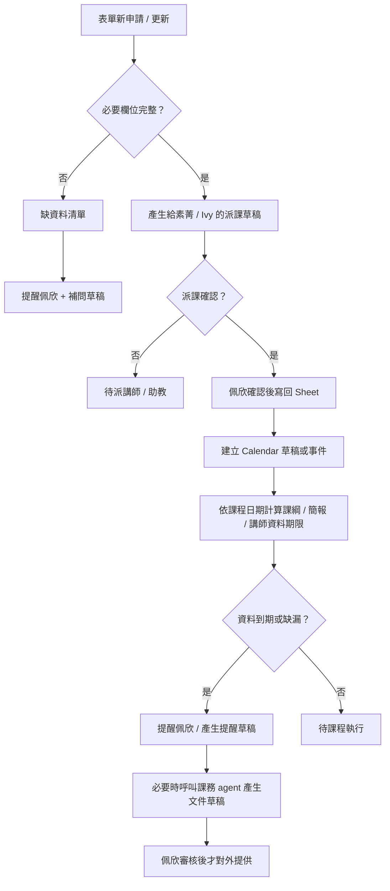
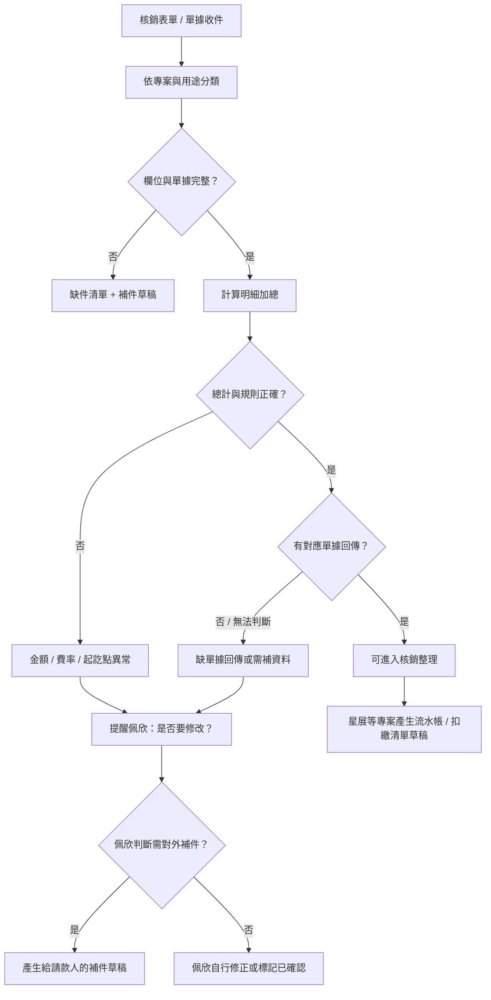
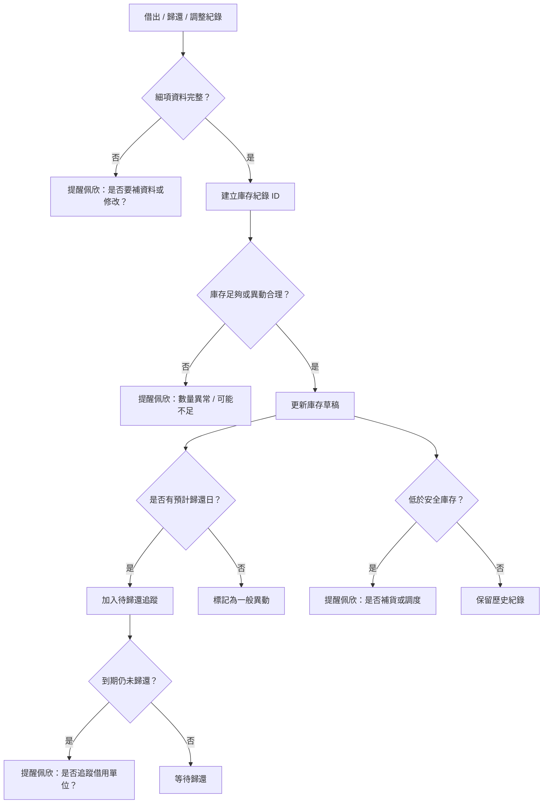
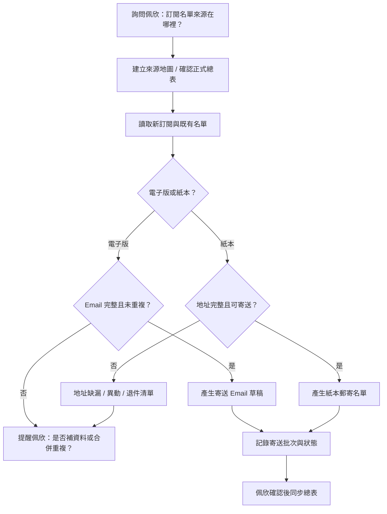
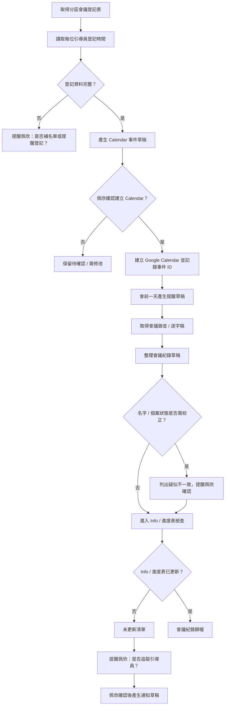
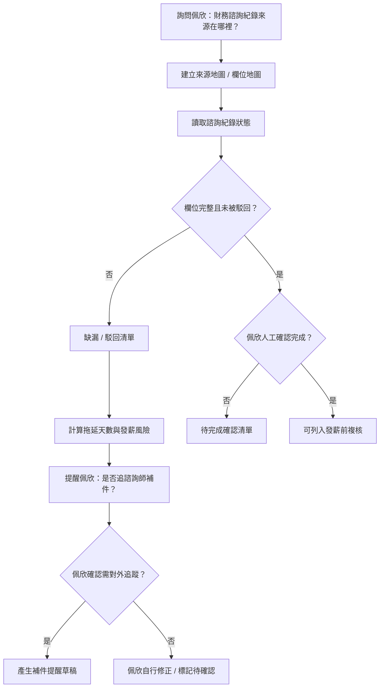
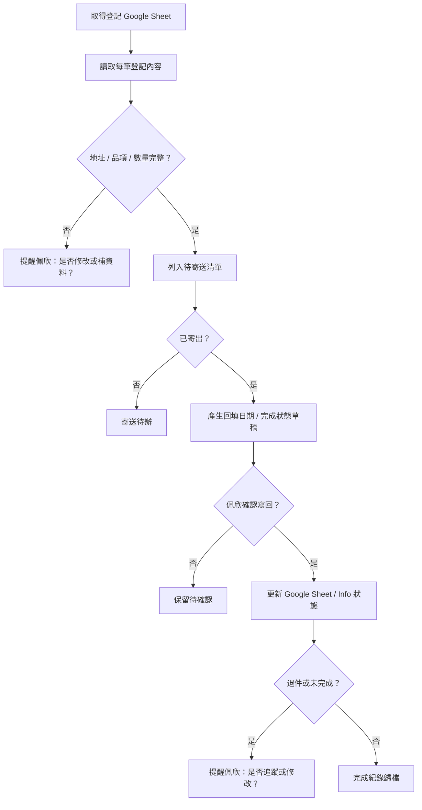
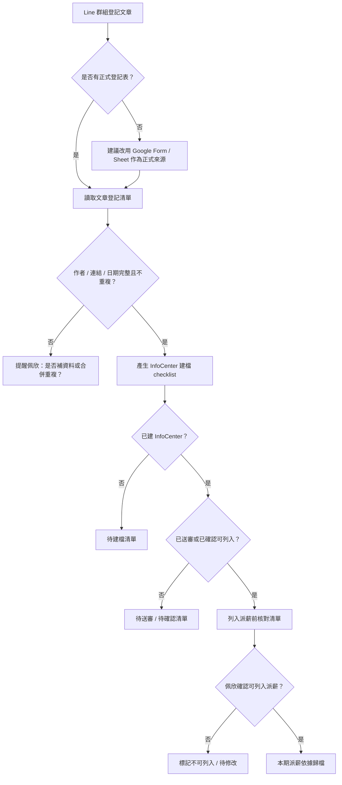
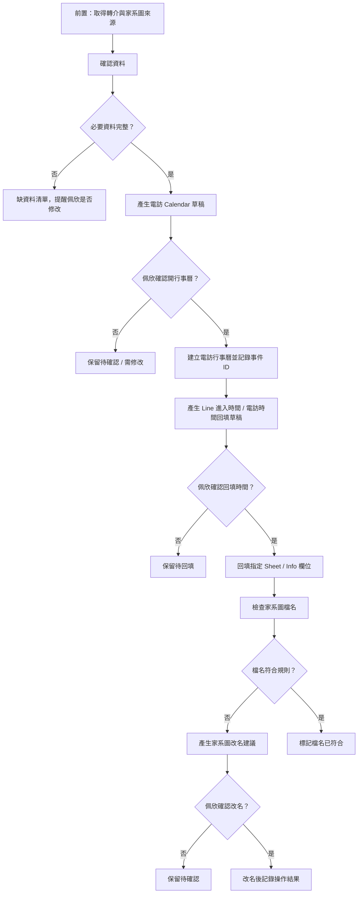

# 佩欣九大工作流流程表

日期：2026-06-03  
用途：作為與佩欣逐項確認、討論自動化範圍的工作底稿。  
原則：先整理流程、提醒與草稿；寫回 Sheet、建立 Calendar、寄送訊息、操作 Info 都需人工確認後才執行。

## 共通細項紀錄規則

後續每一個流程都要留下可與佩欣逐項對照的細項紀錄，而不是只留下總結。紀錄至少包含：

| 紀錄項目 | 用途 |
| --- | --- |
| 來源資料 | 來源表單、Sheet、Excel、Info、Line、Email、檔案或資料夾 |
| 來源位置 | Sheet row、檔名、連結、日期、表單回覆時間或人工紀錄位置 |
| 系統判斷 | 缺資料、金額錯誤、逾期、未歸還、待確認等判斷原因 |
| 建議動作 | 提醒佩欣修改、請對方補件、建立 Calendar、產生草稿、標記完成等 |
| 人工確認 | 佩欣是否確認、確認時間、確認結果、是否允許寫回或發送 |
| 修改紀錄 | 修改前後內容、修改者、修改時間、是否影響後續流程 |
| 提醒紀錄 | 提醒對象、提醒時間、提醒內容、是否已回覆 |
| 完成紀錄 | 完成條件、完成時間、證據或備註 |

## 0. 課務流程待向佩欣確認事項

這一段先記錄 Kevin 與 Codex 已補出的課務閉環，後續需要向佩欣確認。

| 待確認項目 | 目前理解 | 要問佩欣的問題 | 建議自動化方式 |
| --- | --- | --- | --- |
| 缺資料提醒 | 表單有缺欄時，應先提醒佩欣，不直接進派課 | 哪些欄位缺漏一定要補？哪些可先派課後補？ | 每日列出缺欄、來源列、補問草稿 |
| 給素菁 / Ivy 的課務內容 | 這不是 agent prompt，而是固定格式的訊息草稿 | 素菁 / Ivy 目前希望看到哪些欄位？固定順序是什麼？ | 用模板產生一鍵複製內容 |
| Agent prompt 與回覆 | prompt 是給課務 agent 的指令，回覆是可審核草稿 | 哪些情境要呼叫馴錢師課務測試 agent？ | 只在資料完整或佩欣指定時產生草稿 |
| Sheet 寫回 | Agent 或 Codex 產出的資訊可協助回填 | 哪些欄位允許 Codex 幫忙寫回？是否需要新增狀態欄？ | 佩欣確認後才寫回指定欄位 |
| 派課確認 | 派課確認後可建立 Google Calendar | Calendar 要邀請誰？標題與備註格式是什麼？ | Codex 產生 Calendar 草稿或確認後建立 |
| Calendar 備註 | 備註應保留課程細節與來源 | 是否要包含聯絡人、費用、課綱期限、來源列？ | 備註自動帶入單位、主題、時間、地點、待辦 |
| 課綱 / 簡報 / 講師資料期限 | 既有文件只記錄需做 due list，尚未固化天數 | 課前幾天要提供講師資料、課綱、簡報？是否依課程不同？ | 依課程日期每日計算到期與逾期提醒 |
| 提醒紀錄 | 避免每天重複提醒同一件事 | 提醒幾次後要升級？提醒誰？ | 記錄上次提醒時間、對象、內容 |
| 對外版 / 內部版 | 給內部派課與給邀課單位內容不同 | 哪些內部備註不可出現在對外課綱？ | 草稿分為內部派課版、對外課綱版 |

## 1. 課務 / 客戶申請

| 階段 | 觸發 / 輸入 | 判斷 | 輸出 | 自動化可能 |
| --- | --- | --- | --- | --- |
| 收件 | Google 課程邀約表單新增或更新 | 是否新申請、是否已處理 | 新申請清單 | 每日讀 Sheet |
| 完整性檢查 | 單位、聯絡人、主題、日期、地點、費用、發票等欄位 | 是否缺必要欄位 | 缺資料清單與補問草稿 | 自動標示缺欄 |
| 派課整理 | 資料完整的申請 | 是否可轉給素菁 / Ivy | 派課訊息草稿 | 固定模板一鍵複製 |
| 派課確認 | 講師安排、助教安排、正式授課時段 | 是否已派講師與定時間 | Sheet 更新候選資料 | 佩欣確認後寫回 |
| 建檔排程 | 派課與時間確認後 | 是否已建立 Calendar / 備註 | Calendar 事件與備註 | 確認後建立 Calendar |
| 後續追蹤 | 課程日期、講師、課程需求 | 課綱、簡報、講師資料是否到期 | due list 與提醒草稿 | 每日計算到期 / 逾期 |
| 文件草稿 | 課程需求、講師資料、既有模板 | 是否資料足夠生成 | 課綱 / 簡報 / 講師資料草稿 | 呼叫馴錢師課務測試 agent |

## 2. 單據核銷

實際表單：`馴錢師報帳表單 (回應)` / `表單回應 1`。  
目前已讀取 live 表頭，確認表單有專案、日期、請款人、用途、核銷類別、單據數量、行程起訖、各費用分類、總計、單據日期、工作內容與工作時數等欄位。表頭中尚未看到「附件、單據照片、上傳檔案、Drive 連結」欄位，所以「是否有回傳對應單據」需要額外欄位或資料源才能穩定檢查。

### 2.1 待向佩欣確認事項

| 待確認項目 | 目前理解 | 要問佩欣的問題 | 建議自動化方式 |
| --- | --- | --- | --- |
| 單據回傳方式 | 目前 Sheet 有 `單據數量` 與 `單據日期`，但未見附件欄 | 單據照片/發票目前是在哪裡回傳？Google 表單、Line、雲端資料夾、Email，還是紙本？ | 若有檔案來源，建立「單據檔案連結 / 已收到單據 / 核對狀態」欄位 |
| 對應關係 | 核銷列與單據檔案需要能一一對應 | 單據檔名是否有規則？是否含請款人、日期、專案、金額？ | 以來源列號或核銷 ID 對應單據檔案 |
| 錯誤檢查 | 可先檢查缺欄、總計、交通起訖、單據數量、單據日期 | 各專案還有哪些專屬規則？例如費率、公里數、進位、上限 | 規則表設定後自動標錯 |
| 重複請款 | 同一請款人、日期、用途、金額可能重複 | 是否常有重複送出或補送？如何判定同一筆？ | 建立疑似重複清單 |
| 通知對象 | 錯誤或缺單據時應先提醒佩欣，不直接通知請款人 | 佩欣看到錯誤後，是要自己修改，還是請對方重填/補件？ | 工作台顯示「是否要修改」與建議處理方式 |
| 完成狀態 | 目前表單回覆本身不一定代表已核銷完成 | 是否需要 `已核對`、`已通知`、`已入帳`、`已退補件` 狀態？ | 另建狀態欄或 Dashboard，不改原始回覆 |

### 2.2 可自動檢查的錯誤

| 檢查項目 | 判斷方式 | 異常輸出 |
| --- | --- | --- |
| 必填缺漏 | `專案類別`、`訪視/課程/諮詢日期`、`請款人`、`單據用途`、`核銷類別`、`單據費用總計` 是否空白 | 缺欄清單 |
| 明細總計不一致 | 各費用分類金額加總，比對 `單據費用總計` | 金額差異 |
| 交通費缺行程 | 交通相關金額大於 0，但 `行程起訖點說明` 空白 | 缺行程起訖 |
| 有金額但缺單據數量 | 明細或總計大於 0，但 `單據數量` 空白 | 缺單據數量 |
| 有金額但缺單據日期 | 明細或總計大於 0，但 `單據日期` 空白 | 缺單據日期 |
| 單據回傳缺口 | `單據數量` 大於 0，但沒有對應附件/檔案/回傳狀態 | 缺單據回傳，需額外資料源 |
| 疑似重複 | 同請款人、同日期、同用途、同金額重複出現 | 疑似重複請款 |

| 階段 | 觸發 / 輸入 | 判斷 | 輸出 | 自動化可能 |
| --- | --- | --- | --- | --- |
| 收件 | 核銷 Google 表單、單據、Excel | 是否新請款 | 本期請款清單 | 每日或月初讀 Sheet |
| 分類 | 專案類別、課程 / 訪視 / 諮詢日期、用途 | 屬於星展、中信培力、信扶、公司課程或辦公室 | 專案分類清單 | 自動分類 |
| 完整性檢查 | 請款人、日期、用途、類別、單據數量、單據日期 | 是否缺件 | 缺件清單 | 自動標示 |
| 金額核對 | 金額明細、交通費、總計 | 明細加總是否等於總計 | 金額異常清單 | 自動試算 |
| 單據回傳核對 | 單據數量、單據日期、附件/檔案來源 | 是否有回傳對應單據 | 缺單據或無法對應清單 | 需先補附件欄或資料夾對應 |
| 規則核對 | 公里數、費率、進位、交通起訖點 | 是否符合專案規則 | 需人工複核項目 | 規則明確後自動檢查 |
| 修正判斷 | 每筆疑似錯誤或缺件的核銷結果 | 是否提醒佩欣修改或請對方補件 | 佩欣待確認清單 | 產生「是否要修改」提醒 |
| 通知整理 | 佩欣確認需要對外補件時 | 是否需請請款人補資料或重填 | 個別訊息草稿 | 佩欣確認後才產生對外通知草稿 |
| 流水帳 / 扣繳 | 星展或需另外建帳的專案 | 是否需轉入流水帳 | 匯入草稿或清單 | 先做半自動匯入 |

## 3. 庫存管理

目前理解：這個流程的第一步是向佩欣取得她目前用來統計庫存的 Excel。拿到 Excel 後，先做欄位盤點，再依她現有格式執行庫存檢查、借出/歸還追蹤、未歸還提醒與低庫存提醒。第三個流程的重點是幫她知道「現在剩多少、借給誰、哪筆還沒回來、哪些快不夠」，並且保留每一筆異動紀錄。

### 3.1 待向佩欣確認事項

| 待確認項目 | 目前理解 | 要問佩欣的問題 | 建議自動化方式 |
| --- | --- | --- | --- |
| 庫存來源 | 需要先取得佩欣目前統計用的 Excel | 請佩欣提供目前庫存統計 Excel，並說明哪個分頁是主表、借出表、歸還表 | 先只讀 Excel，建立欄位地圖 |
| 品項分類 | 可能包含教材、桌遊、課程道具、手冊、耗材 | 哪些品項需要追蹤數量？哪些只需記錄出借？ | 建立品項主檔與安全庫存 |
| 借出紀錄 | 需要記錄日期、活動、單位、數量、借用人 | 借出時目前誰登記？是否有固定格式？ | 每筆借出建立來源列與狀態 |
| 歸還紀錄 | 需要知道是否歸還、歸還日期、歸還數量 | 歸還是誰確認？部分歸還怎麼記？ | 產生待歸還 / 部分歸還清單 |
| 未歸還提醒 | 借出後可能忘記追 | 幾天未歸還要提醒？提醒佩欣還是借用單位？ | 每日列出逾期未歸還，先提醒佩欣 |
| 低庫存提醒 | 課程前可能發現物資不夠 | 每個品項的最低安全量是多少？ | 低於門檻時提醒佩欣是否補貨 |
| 損耗 / 報廢 | 道具可能遺失、損壞或消耗 | 是否需要記錄損耗原因？誰可確認報廢？ | 建立損耗紀錄，不自動扣除正式庫存 |
| 細項紀錄 | 後續要與佩欣對照每筆判斷 | 她希望每次提醒看到哪些欄位？ | 每次判斷保留品項、數量、來源列、原因、建議動作 |

### 3.0 前置條件

| 前置條件 | 說明 |
| --- | --- |
| 取得庫存 Excel | 先向佩欣取得她目前統計庫存的 Excel，作為唯一來源，不先另建格式 |
| 確認分頁用途 | 標出主庫存、借出紀錄、歸還紀錄、盤點或備註分頁 |
| 建立欄位地圖 | 對照品項、分類、數量、借出日期、借出單位、活動、歸還狀態等欄位 |
| 保留原檔 | 第一版只讀與產生檢查報告，不直接改原 Excel |
| 產出待辦 | 根據 Excel 產生未歸還、低庫存、數量異常、資料缺漏清單 |

### 3.2 細項紀錄欄位

| 紀錄欄位 | 說明 |
| --- | --- |
| 庫存紀錄 ID | 系統產生，用來追蹤每筆借出 / 歸還 / 調整 |
| 來源列號 / 檔案 | 原始 Excel / Sheet 的列號或檔名 |
| 品項名稱 | 教材、道具、手冊、耗材等名稱 |
| 品項分類 | 教材、活動道具、行政用品、耗材等 |
| 異動類型 | 借出、歸還、盤點調整、損耗、補貨 |
| 異動數量 | 本次增加或減少數量 |
| 借出日期 | 物資借出日期 |
| 預計歸還日期 | 用來計算提醒與逾期 |
| 實際歸還日期 | 完成歸還時填入 |
| 活動 / 課程 | 借出用途或活動名稱 |
| 借出單位 / 借用人 | 之後追蹤物資用 |
| 目前狀態 | 待歸還、部分歸還、已歸還、逾期、待確認、已報廢 |
| 系統判斷 | 例如「逾期 7 天」「低於安全庫存」「歸還數量不一致」 |
| 建議動作 | 提醒佩欣追物資、確認是否補貨、確認是否報廢 |
| 佩欣確認 | 已確認、要修改、要提醒對方、先略過 |
| 備註 | 損壞、缺件、替代品、特殊活動需求 |

| 階段 | 觸發 / 輸入 | 判斷 | 輸出 | 自動化可能 |
| --- | --- | --- | --- | --- |
| 收件 | 教材 / 道具借出或歸還紀錄 | 是否新增借出、歸還或調整 | 異動清單 | 讀 Excel / Sheet |
| 細項紀錄 | 品項、數量、活動、借出單位、日期 | 是否資料足以追蹤 | 可對照紀錄 | 建立庫存紀錄 ID |
| 庫存更新 | 異動類型與數量 | 數量是否足夠、是否可扣庫存 | 即時庫存草稿 | 佩欣確認後才正式更新 |
| 未歸還追蹤 | 借出日期、預計歸還日、實際歸還日 | 是否逾期未歸還 | 未歸還清單 | 每日提醒佩欣 |
| 低庫存提醒 | 目前數量、最低安全量、已預約活動 | 是否低於門檻或即將不足 | 補貨 / 調度提醒 | 自動列提醒 |
| 異常處理 | 部分歸還、數量不一致、損壞、遺失 | 是否需要佩欣修改或確認 | 待確認清單 | 提醒佩欣是否修改 |
| 歷史紀錄 | 活動、單位、品項流向 | 是否需查詢 | 品項流向紀錄 | Dashboard |

## 4. 季刊訂閱

目前理解：這個流程要先詢問佩欣目前訂閱名單的資料來源，因為季刊可能同時來自 Google 表單、QR Code 回覆、既有 Excel / Sheet 總表、Email 或人工整理名單。確認來源後，才能判斷如何自動分類電子版/紙本、檢查重複與缺資料、產生寄送清單與提醒。

### 4.0 前置條件

| 前置條件 | 說明 |
| --- | --- |
| 確認名單來源 | 詢問佩欣目前訂閱名單在哪裡：Google 表單、Excel、Google Sheet、Email、Line 或紙本整理 |
| 確認主檔 | 如果有多個來源，需指定哪一份是正式總表，避免重複或覆蓋 |
| 取得欄位 | 盤點姓名、Email、地址、訂閱類型、訂閱期間、續訂、退件、異動等欄位 |
| 保留原檔 | 第一版只讀來源資料，產生檢查清單，不直接改名單 |
| 定義寄送狀態 | 確認電子版已寄、紙本已寄、退件、停寄、地址異動等狀態如何記錄 |

### 4.1 待向佩欣確認事項

| 待確認項目 | 目前理解 | 要問佩欣的問題 | 建議自動化方式 |
| --- | --- | --- | --- |
| 訂閱來源 | 可能有表單、總表、人工名單多個來源 | 目前正式訂閱名單是哪一份？新增訂閱從哪裡進來？ | 先建立來源地圖 |
| 電子 / 紙本分類 | 需要分流寄送方式 | 欄位中是否已有訂閱類型？可否區分電子版、紙本、兩者都要？ | 自動分類清單 |
| 缺資料 | 電子版需要 Email，紙本需要地址 | 哪些欄位缺漏會影響寄送？ | 每日列缺資料清單 |
| 重複資料 | 同一人可能重複填表或續訂 | 重複判斷以姓名、Email、電話、地址哪個為準？ | 疑似重複清單 |
| 續訂 / 停寄 | 需要知道是否仍有效 | 訂閱期限怎麼算？有無退訂或停寄欄位？ | 到期與停寄提醒 |
| 地址異動 / 退件 | 紙本容易有地址變更或退件 | 地址異動在哪裡記？退件後如何追蹤？ | 地址異動與退件待辦 |
| 寄送紀錄 | 後續要與佩欣對照 | 寄送後需要記錄寄送日期、批次、操作者嗎？ | 建立寄送批次與完成紀錄 |

### 4.2 細項紀錄欄位

| 紀錄欄位 | 說明 |
| --- | --- |
| 訂閱紀錄 ID | 系統產生，用來追蹤每位訂閱者 |
| 來源資料 | Google 表單、Excel、Sheet、Email、Line 或人工名單 |
| 來源列號 / 檔案 | 原始資料位置 |
| 訂閱者名稱 | 名單辨識用，公開輸出需遮罩 |
| Email | 電子版寄送用 |
| 地址 | 紙本寄送用，需注意個資 |
| 訂閱類型 | 電子版、紙本、兩者皆是 |
| 訂閱狀態 | 新訂閱、續訂、停寄、退訂、退件、地址異動 |
| 寄送批次 | 對應哪一期季刊或哪一批寄送 |
| 寄送狀態 | 待寄、已寄、寄送失敗、退件、待確認 |
| 系統判斷 | 缺 Email、缺地址、疑似重複、地址異動、到期 |
| 建議動作 | 提醒佩欣修改、合併重複、補地址、寄送電子版、列入紙本名單 |
| 佩欣確認 | 已確認、要修改、要補問、先略過 |

| 階段 | 觸發 / 輸入 | 判斷 | 輸出 | 自動化可能 |
| --- | --- | --- | --- | --- |
| 來源確認 | 訂閱表單、Excel、Google Sheet、Email、Line | 哪一份是正式來源 | 來源地圖 | 先問佩欣並盤點 |
| 訂閱收件 | QR Code / Google 表單 / 既有總表 | 紙本或電子版 | 新訂閱清單 | 每日讀 Sheet / Excel |
| 資料清理 | 姓名、Email、地址、訂閱類型 | 是否缺資料或重複 | 缺資料 / 重複清單 | 自動比對 |
| 電子版處理 | Email、期刊連結 | 是否可寄送 | Email 草稿 | 審核後寄送 |
| 紙本處理 | 地址、續訂、退件、地址異動 | 是否需更新地址 | 郵寄名單 | 產生郵寄清單 |
| 寄送紀錄 | 寄送批次、寄送日期、寄送狀態 | 是否已寄送或退件 | 完成 / 退件清單 | 留下細項紀錄 |
| 紀錄同步 | 季刊總表 | 是否已搬到總表 | 更新清單 | 佩欣確認後才寫回 |

## 5. 分區會議

目前理解：分區會議流程不是只有提醒開會，而是從「分區會議登記表格」讀取每位引導員登記的時間，協助新增對應 Google Calendar，再接會前提醒、會後逐字稿整理、個案/名單校正，到檢查 Info 或進度表是否更新。第五個流程的第一步應該是向佩欣取得登記分區會議的表格，並確認目前會議資料來源與會後檢查來源。

### 5.0 前置條件

| 前置條件 | 說明 |
| --- | --- |
| 取得分區會議登記表 | 向佩欣取得目前引導員登記分區會議時間的表格 |
| 確認會議時段來源 | 確認每位引導員登記的日期、時間、分區、會議方式與備註欄位 |
| 確認會議名單來源 | 確認每次會議應出席人員、分區、個案或討論對象來源 |
| 確認會議連結來源 | 會議連結是固定、Calendar、Line 群組，還是每次另給 |
| 確認 Calendar 規則 | 確認要建立到哪個 Google Calendar、是否邀請引導員、標題與備註格式 |
| 確認會後資料來源 | 錄音、逐字稿、會議紀錄草稿放在哪裡 |
| 確認 Info 檢查來源 | 會後要比對哪個 Info 欄位或進度提醒表 |
| 第一版只做草稿與確認後建立 | 不自動截圖、不自動操作 Info、不自動傳 Line；Calendar 也先產生草稿，佩欣確認後建立 |

### 5.1 待向佩欣確認事項

| 待確認項目 | 目前理解 | 要問佩欣的問題 | 建議自動化方式 |
| --- | --- | --- | --- |
| 會議登記表 | 引導員會在分區會議表格登記時間 | 登記表在哪裡？欄位有哪些？是否有分區、姓名、日期、時間、會議方式、備註？ | 讀取登記表，列出未登記或資料缺漏 |
| Calendar 建立 | 需要根據每位引導員登記時間新增行事曆 | Calendar 標題、受邀者、地點/會議連結、備註要放哪些內容？ | 佩欣確認後由 Codex 建立 Calendar |
| 會前提醒 | 會前一天需要提醒與提供連結 | 提醒對象是引導員、佩欣自己，還是 Line 群組？ | 產生會前提醒草稿 |
| 出席紀錄 | 會議後要知道誰有參加 | 出席如何記錄？逐字稿、名單或人工勾選？ | 產生出席待確認清單 |
| 逐字稿整理 | 會後需要整理會議紀錄 | 錄音/逐字稿來源在哪？會議紀錄格式是什麼？ | AI 產生會議紀錄草稿，保留來源 |
| 名字 / 個案校正 | 逐字稿可能名字錯或狀態不一致 | 要以哪份名單為準？是否有不可外流個資？ | 產生疑似名字不一致清單 |
| Info 更新檢查 | 會後要檢查引導員是否更新 Info | 要檢查哪些欄位？多久內要完成？ | 列出未更新清單，先提醒佩欣 |
| 追蹤通知 | 未更新時佩欣會截圖或通知 | 要先提醒佩欣判斷，還是產生給引導員草稿？ | 佩欣確認後才產生通知草稿 |

### 5.2 細項紀錄欄位

| 紀錄欄位 | 說明 |
| --- | --- |
| 會議紀錄 ID | 系統產生，串起會前、會中、會後紀錄 |
| 會議日期 / 時段 | 分區會議時間 |
| 分區 / 主題 | 會議分類與討論主題 |
| 引導員 | 登記該分區會議時間的人 |
| 登記表來源列 | 對應分區會議登記表列號 |
| Calendar 事件 ID | 確認建立後回填，用來避免重複建立 |
| Calendar 建立狀態 | 未建立、草稿、已建立、需修改、已取消 |
| 會議連結 | Meet / Zoom / 其他連結 |
| 應出席名單 | 原始登記表或名單來源 |
| 實際出席狀態 | 已出席、未出席、待確認 |
| 錄音 / 逐字稿來源 | 檔案、連結或來源位置 |
| 會議紀錄草稿 | AI 或人工整理版本 |
| 名字校正項目 | 疑似錯字、同音、個案狀態不一致 |
| Info 檢查項目 | 要檢查的欄位、狀態與來源位置 |
| 系統判斷 | 未登記、未出席、逐字稿缺漏、Info 未更新等 |
| 建議動作 | 提醒佩欣、補名單、整理紀錄、請引導員更新 Info |
| 佩欣確認 | 已確認、要修改、要提醒對方、先略過 |
| 提醒紀錄 | 提醒時間、對象、內容、是否回覆 |

| 階段 | 觸發 / 輸入 | 判斷 | 輸出 | 自動化可能 |
| --- | --- | --- | --- | --- |
| 來源確認 | 分區會議登記表、會議名單、連結、Info 檢查來源 | 是否取得完整來源 | 來源地圖 | 先問佩欣 |
| 會前登記 | 引導員在表格登記分區會議時間 | 是否有人未登記或資料缺漏 | 未登記 / 缺資料清單 | 會前提醒 |
| Calendar 草稿 | 每位引導員登記的日期、時間、分區、會議方式 | 是否足以建立 Calendar | Calendar 事件草稿 | 佩欣確認後建立 |
| 會前提醒 | 會議日期、連結、名單 | 是否到會前一天 | 提醒草稿 | 自動生成提醒 |
| 會中資料 | 錄音、逐字稿、出席者 | 是否取得紀錄 | 逐字稿素材 | 會議包 |
| 會後紀錄 | 逐字稿、個案名單、狀態 | 名字與狀態是否一致 | 會議紀錄草稿 | AI 輔助整理 |
| Info 檢查 | 進度提醒表、Info 欄位 | 是否未更新 | 未更新名單 | 先做檢查，不自動操作 |
| 追蹤判斷 | 未更新者、缺紀錄者 | 是否提醒佩欣處理 | 佩欣待確認清單 | 提醒佩欣是否追蹤 |
| 追蹤通知 | 佩欣確認需對外提醒時 | 是否需提醒引導員 | Line 草稿 | 佩欣確認後人工貼上 |

## 6. 財務諮詢紀錄

目前理解：財務諮詢紀錄牽涉個案、諮詢師補件、Info 欄位、評論/駁回狀態，以及素菁或內部發薪依據。這個流程敏感度高，第一版應只做只讀檢查與提醒，不自動勾選「諮詢完成」、不自動操作 Info、不自動影響薪資。

### 6.0 前置條件

| 前置條件 | 說明 |
| --- | --- |
| 確認資料來源 | 詢問佩欣目前財務諮詢紀錄在哪裡：Info、Google Sheet、表單、Excel 或其他系統 |
| 確認欄位位置 | 確認諮詢師、個案、約訪日期、送審日期、評論、駁回原因、完成狀態在哪些欄位 |
| 確認完成規則 | 由佩欣說明什麼條件才算諮詢完成，哪些狀態會影響發薪 |
| 確認補件期限 | 幾天未補件要提醒？15 號發薪前幾天要做總檢查？ |
| 個資遮罩 | 個案姓名、聯絡資訊、家庭資訊等敏感資料在報告中預設遮罩 |
| 第一版只做檢查 | 只產生缺漏、逾期、駁回、待完成清單，不寫回 Info、不勾完成 |

### 6.1 待向佩欣確認事項

| 待確認項目 | 目前理解 | 要問佩欣的問題 | 建議自動化方式 |
| --- | --- | --- | --- |
| 紀錄來源 | 可能在 Info、評論、表單或表格中 | 財務諮詢紀錄實際資料來源是哪裡？是否可匯出？ | 先只讀或請佩欣提供匯出檔 |
| 缺漏欄位 | 佩欣需要檢查欄位是否完整 | 哪些欄位缺漏會阻止完成？ | 建立缺漏規則表 |
| 駁回原因 | 被駁回後需要追蹤修正 | 駁回原因在哪裡看？修正後如何判定已處理？ | 每日列出駁回未修正清單 |
| 逾期標準 | 有些紀錄拖很久會影響管理 | 幾天沒補件算逾期？發薪日前是否有特殊檢查？ | 計算拖延天數與發薪前風險 |
| 完成勾選 | 完成狀態會影響薪資依據 | 誰可以確認完成？佩欣確認後要不要請 Codex 輔助寫回？ | 預設不自動勾完成，只提示 |
| 提醒對象 | 可能是諮詢師、佩欣或素菁 | 錯誤先提醒佩欣，還是產生給諮詢師草稿？ | 先提醒佩欣是否要追 |
| 細項紀錄 | 後續需與佩欣對照 | 她希望每筆看到個案代碼、諮詢師、缺欄、拖延天數或來源連結？ | 每筆保留來源與判斷依據 |

### 6.2 細項紀錄欄位

| 紀錄欄位 | 說明 |
| --- | --- |
| 諮詢追蹤 ID | 系統產生，用來追蹤每筆諮詢紀錄 |
| 來源系統 | Info、Sheet、表單、Excel 或匯出檔 |
| 來源位置 | Info 連結、Sheet row、檔名或匯出批次 |
| 個案識別 | 預設用代碼或遮罩名稱，避免外流個資 |
| 諮詢師 | 負責填寫紀錄的人 |
| 約訪日期 | 判斷是否逾期的基準 |
| 紀錄填寫日期 | 諮詢師填紀錄的時間 |
| 送審 / 駁回日期 | 判斷流程狀態 |
| 駁回原因 | 原始駁回文字或分類 |
| 缺漏欄位 | 哪些欄位未填或格式錯 |
| 拖延天數 | 從約訪、送審或駁回後開始計算 |
| 發薪風險 | 是否接近 15 號仍未完成 |
| 系統判斷 | 缺資料、被駁回、逾期、待佩欣確認、可完成 |
| 建議動作 | 提醒佩欣修改、請諮詢師補件、標記待確認、發薪前複核 |
| 佩欣確認 | 已確認、要追蹤、要修改、不可完成、先略過 |
| 提醒紀錄 | 提醒時間、對象、內容、是否回覆 |

| 階段 | 觸發 / 輸入 | 判斷 | 輸出 | 自動化可能 |
| --- | --- | --- | --- | --- |
| 來源確認 | Info、Sheet、表單、Excel、評論欄位 | 是否取得完整來源 | 來源地圖 | 先問佩欣 |
| 轉介 / 約訪 | 個案轉介、諮詢師約訪 | 是否已有諮詢紀錄 | 待填紀錄清單 | 每日檢查 |
| 紀錄檢查 | Info 欄位、評論、駁回原因 | 是否缺欄或被駁回 | 補件清單 | 自動列缺漏 |
| 逾期判斷 | 約訪日期、送審日期、現在日期 | 是否拖延過久 | 逾期清單 | 每日提醒 |
| 錯誤提醒 | 缺漏、駁回、逾期、發薪前未完成 | 是否提醒佩欣處理 | 佩欣待確認清單 | 提醒佩欣是否要追 |
| 補件草稿 | 佩欣確認需要對外追蹤 | 是否需請諮詢師補資料 | 補件提醒草稿 | 佩欣確認後人工貼上 |
| 完成確認 | 缺漏修正、審核通過 | 是否可勾完成 | 待人工確認清單 | 不自動勾完成 |
| 發薪依據 | 完成狀態、15 號前檢查 | 是否影響發薪 | 發薪前複核清單 | 只做提醒與證據 |

## 7. 引導員小老闆日誌 / 郵寄

目前理解：這個流程已有一張 Google Sheet 在記錄登記內容。第七個流程應先取得這張登記 Sheet，讀取每筆申請、寄送品項、收件資訊與目前狀態，再協助佩欣整理待寄送、缺資料、待回填、未完成或退件追蹤。第一版仍以只讀檢查與提醒為主，寫回 Sheet 或 Info 需佩欣確認。

### 7.0 前置條件

| 前置條件 | 說明 |
| --- | --- |
| 取得登記 Google Sheet | 向佩欣取得目前記錄小老闆日誌 / 郵寄登記內容的 Google Sheet |
| 確認分頁與欄位 | 確認哪個分頁是正式登記表，欄位包含申請人、地址、品項、數量、寄送狀態、寄送日期等 |
| 確認回填位置 | 確認完成狀態要回填到 Google Sheet、Info，或兩邊都要 |
| 確認寄送規則 | 確認哪些品項要寄、是否有固定寄送批次、誰負責寄出 |
| 第一版只讀 | 先只產生待寄送、缺資料、待回填、未完成追蹤清單，不直接改原 Sheet 或 Info |

### 7.1 待向佩欣確認事項

| 待確認項目 | 目前理解 | 要問佩欣的問題 | 建議自動化方式 |
| --- | --- | --- | --- |
| 登記 Sheet | 已有 Google Sheet 記錄登記內容 | Sheet 連結是哪一份？哪個分頁是正式資料？ | 只讀 Sheet，建立欄位地圖 |
| 申請資料 | 需要知道收件人、地址、品項、數量 | 哪些欄位缺漏會不能寄？ | 每日列出缺資料 |
| 寄送狀態 | 需要判斷待寄、已寄、待回填 | 目前狀態欄怎麼填？是否有固定選項？ | 建立狀態分類 |
| 回填需求 | 佩欣寄出後可能要回填日期與完成狀態 | 回填到 Google Sheet 還是 Info？是否需要兩邊同步？ | 佩欣確認後才寫回 |
| 退件 / 未完成 | 寄送後可能退件或狀態未完成 | 退件怎麼記？多久沒完成要提醒？ | 每日追蹤清單 |
| 通知對象 | 缺資料或退件時要先提醒佩欣 | 佩欣看到後是自己修改，還是請對方補資料？ | 先提醒佩欣是否要修改或追蹤 |

### 7.2 細項紀錄欄位

| 紀錄欄位 | 說明 |
| --- | --- |
| 郵寄追蹤 ID | 系統產生，用來追蹤每筆登記與寄送 |
| Google Sheet 來源列 | 對應登記表列號 |
| 申請日期 | 登記表中的申請時間 |
| 申請人 / 收件人 | 對內辨識用，公開輸出需遮罩 |
| 收件地址 | 紙本寄送用，屬個資需遮罩 |
| 寄送品項 | 手冊、小老闆資料或其他品項 |
| 寄送數量 | 本次需寄數量 |
| 寄送狀態 | 待寄送、已寄送、待回填、退件、取消、已完成 |
| 寄送日期 | 實際寄出日期 |
| 回填狀態 | Google Sheet / Info 是否已更新 |
| 系統判斷 | 缺地址、缺品項、待寄送、待回填、退件、逾期未完成 |
| 建議動作 | 提醒佩欣修改、補資料、寄送、回填日期、追蹤退件 |
| 佩欣確認 | 已確認、要修改、要追蹤、已完成、先略過 |
| 提醒紀錄 | 提醒時間、對象、內容、是否回覆 |

| 階段 | 觸發 / 輸入 | 判斷 | 輸出 | 自動化可能 |
| --- | --- | --- | --- | --- |
| 來源確認 | 小老闆日誌 / 郵寄登記 Google Sheet | 是否取得正式來源 | 來源地圖 | 先問佩欣 |
| 申請收件 | Google Sheet 登記內容 | 是否新申請 | 待寄送清單 | 每日讀取 |
| 資料確認 | 收件人、地址、品項 | 是否缺資料 | 缺資料提醒 | 自動標示 |
| 寄送處理 | 寄送日期、品項、數量 | 是否已寄出 | 待寄 / 已寄清單 | 產生寄送清單 |
| 回填狀態 | Google Sheet / Info 狀態 | 是否需補寄送日期或完成勾選 | 待回填清單 | 佩欣確認後寫回 |
| 錯誤提醒 | 缺資料、退件、待回填、狀態不一致 | 是否提醒佩欣修改 | 佩欣待確認清單 | 提醒佩欣是否要修改 |
| 追蹤 | 未完成或退件 | 是否需再次處理 | 追蹤提醒 | 每日提醒 |

## 8. 粉絲團文章

目前理解：這段不是單純追蹤粉絲團文章，而是大家在 Line 上登記已產出的文章，佩欣需要把文章存到 InfoCenter，並且作為後續派薪或稿費核對依據。因為 Line 訊息本身不適合長期查核，建議不要只依賴 Line 當唯一紀錄；比較好的機制是讓 Line 作為通知入口，但把登記資料導入 Google Form / Google Sheet，形成可查詢、可去重、可對帳、可匯入 InfoCenter 的正式清單。

### 8.0 建議機制

| 方案 | 做法 | 優點 | 限制 / 風險 |
| --- | --- | --- | --- |
| A. Line 訊息人工整理 | 大家仍在 Line 登記，佩欣或 Codex 協助整理成清單 | 改變最小 | Line 訊息難查、格式不一、容易漏、難作為派薪依據 |
| B. Line + Google Form | 在 Line 群組固定丟登記表單，大家填文章連結、作者、日期、類型 | 最適合第一版，直接產生 Sheet，容易對帳 | 需要大家改成填表，不只丟 Line |
| C. Google Sheet 登記表 | 大家直接在 Sheet 填文章資料 | 透明、可即時查看 | 容易誤改他人資料，需要權限與欄位保護 |
| D. Line Bot / webhook | Line 訊息自動進資料庫或 Sheet | 最自動 | 需要建 bot、權限與維護，第一版不建議先做 |
| E. InfoCenter API / 匯入 | 從正式清單匯入 InfoCenter | 長期最省工 | 需確認 InfoCenter 是否有 API 或批次匯入 |

第一版建議採 `B. Line + Google Form`：大家仍在 Line 群組收到提醒，但正式登記改成表單。佩欣每天只看 Sheet 的缺漏、重複、待建 InfoCenter、待送審與派薪核對清單。

### 8.1 前置條件

| 前置條件 | 說明 |
| --- | --- |
| 確認 Line 登記現況 | 詢問目前大家在 Line 會貼哪些內容：文章連結、作者、日期、截圖、標題或其他資訊 |
| 確認正式登記來源 | 決定是否改用 Google Form / Sheet 作為正式清單 |
| 確認 InfoCenter 欄位 | 盤點 InfoCenter 建檔需要哪些欄位：文章標題、連結、作者、日期、分類、評論、送審狀態等 |
| 確認派薪規則 | 哪些文章可計入派薪？是否需要審核、字數、篇數、發布日期或類型條件 |
| 確認重複規則 | 同一篇文章重複登記時，以文章連結、標題、作者、日期哪個為準 |
| 第一版只做清單 | 先做待建 InfoCenter 與派薪核對清單，不自動送審、不自動判定薪資 |

### 8.2 待向佩欣確認事項

| 待確認項目 | 目前理解 | 要問佩欣的問題 | 建議自動化方式 |
| --- | --- | --- | --- |
| Line 登記格式 | 大家在 Line 上登記文章 | 目前大家貼文格式固定嗎？是否會漏作者、日期或連結？ | 整理現有格式，設計表單欄位 |
| 正式來源 | Line 不適合當唯一派薪依據 | 是否能改成 Line 提醒大家填 Google Form？ | Form 回覆進 Sheet 作為正式台帳 |
| InfoCenter 建檔 | 佩欣要把文章放到 InfoCenter | InfoCenter 需要填哪些欄位？是否可匯入或只能人工建？ | 產生建檔 checklist / 草稿 |
| 派薪依據 | 文章紀錄會作為派薪依據 | 以文章篇數、核准狀態、發布日期或完成送審為準？ | 產生派薪前核對表，不自動核薪 |
| 審核狀態 | 文章可能需送審或確認 | 誰確認文章可計入？佩欣、素菁或其他人？ | 保留人工確認欄 |
| 重複與缺漏 | Line/表單可能重複或缺欄 | 重複怎麼處理？缺資料要提醒誰？ | 每日缺漏與重複清單 |

### 8.3 細項紀錄欄位

| 紀錄欄位 | 說明 |
| --- | --- |
| 文章登記 ID | 系統產生，用來追蹤每篇文章 |
| 來源 | Line、Google Form、Google Sheet、人工補登 |
| 來源位置 | Line 日期/截圖、Sheet row、表單回覆時間 |
| 登記人 | 誰登記這篇文章 |
| 作者 / 負責人 | 作為派薪或稿費核對依據 |
| 文章標題 | 文章識別用 |
| 文章連結 | 最重要的去重與查核依據 |
| 發布日期 | 判斷期別與派薪月份 |
| 文章類型 / 分類 | 粉專文章、活動文、個案故事、知識文等 |
| InfoCenter 狀態 | 待建檔、已建檔、待送審、已送審、需修改 |
| InfoCenter 連結 / ID | 建檔後回填，避免重複建檔 |
| 派薪狀態 | 待確認、可列入、不可列入、已列入本期 |
| 系統判斷 | 缺連結、缺作者、疑似重複、尚未建 InfoCenter、派薪前未確認 |
| 建議動作 | 提醒佩欣補資料、建立 InfoCenter、確認是否列入派薪 |
| 佩欣確認 | 已確認、要修改、不可列入、要追問、先略過 |
| 派薪核對紀錄 | 本期核對日期、核對人、核對結果 |

| 階段 | 觸發 / 輸入 | 判斷 | 輸出 | 自動化可能 |
| --- | --- | --- | --- | --- |
| 來源確認 | Line 登記、Google Form、Sheet、InfoCenter | 哪一份是正式派薪依據來源 | 來源地圖 | 先問佩欣 |
| 登記收件 | Line 登記或 Google Form 回覆 | 是否新文章 | 新文章清單 | 建議用 Form 進 Sheet |
| 資料檢查 | 作者、標題、連結、日期、類型 | 是否缺資料或重複 | 缺漏 / 重複清單 | 自動檢查 |
| InfoCenter 建檔 | 文章資料、分類、評論、送審欄位 | 哪些欄位要填 | 建檔 checklist | 產生待填欄位草稿 |
| InfoCenter 狀態 | 已建檔、待送審、已送審、需修改 | 是否完成存檔 | 待建 / 待送審清單 | 不自動送審 |
| 派薪核對 | 作者、文章、月份、InfoCenter 狀態 | 是否可列入本期派薪 | 派薪前核對清單 | 只做證據與提醒 |
| 歸檔 | 文章與 InfoCenter 紀錄 | 是否完成 | 歸檔清單 | 每日 / 每月報告 |

## 9. 個案轉介與家系圖

目前理解：第九個工作的核心是四件事：確認資料、開電訪行事曆、回填時間、家系圖改名。來源盤點只是前置工作，目的是讓這四件事有依據。因為涉及個案與家庭資料，第一版只做缺漏提醒、Calendar 草稿、回填草稿與檔名建議；不自動改個案資料、不自動改檔名、不自動搬檔、不自動寫回敏感欄位。

### 9.0 前置條件

| 前置條件 | 說明 |
| --- | --- |
| 確認轉介來源 | 詢問佩欣目前個案轉介資料來源：Google 表單、Google Sheet、Line、Info 或其他系統 |
| 確認 Line 進入紀錄 | 確認 Line 進入時間目前如何記錄，是否有固定欄位或只在訊息中 |
| 確認電訪排程規則 | 確認宇宏電訪如何排程、要建在哪個 Calendar、標題與備註格式 |
| 確認回填欄位 | 確認 Line 進入時間、電訪時間、完成狀態要回填到哪裡 |
| 確認家系圖來源 | 取得家系圖檔案來源資料夾與現有命名方式 |
| 確認命名規則 | 請佩欣提供家系圖檔名格式，例如日期、個案代碼、單位、版本等 |
| 個資遮罩 | 報告中預設使用個案代碼或遮罩名稱，不輸出完整個資 |
| 第一版只做建議 | Calendar、寫回、改名、搬檔都需佩欣確認後才執行 |

### 9.1 待向佩欣確認事項

| 待確認項目 | 目前理解 | 要問佩欣的問題 | 建議自動化方式 |
| --- | --- | --- | --- |
| 轉介表單 / Sheet | 可能已有表單或 Sheet 記錄轉介內容 | 正式轉介資料在哪裡？欄位有哪些？ | 只讀來源，建立欄位地圖 |
| Line 進入時間 | 佩欣需要記錄 Line 進入時間 | Line 進入時間目前怎麼取得？是否人工判斷？ | 先產生待回填清單，不自動抓 Line |
| 電訪 Calendar | 需要協助安排宇宏電訪 | 電訪 Calendar 建在哪？要邀請誰？備註要放哪些資料？ | 產生 Calendar 草稿，確認後建立 |
| 回填時間 | Line 進入時間與電訪時間需回填 | 回填到表單、Sheet、Info 還是哪個總表？ | 佩欣確認後才寫回 |
| 家系圖命名 | 家系圖需依固定格式改名 | 完整命名規則是什麼？若缺欄位怎麼處理？ | 產生檔名建議，先不自動改名 |
| 改名後處理 | 家系圖改名後可能還要歸檔 | 改名後是否只更新檔名，還是也要放到指定資料夾？ | 第一版先只產生檔名建議 |
| 敏感資料 | 家系圖與個案資料敏感 | 哪些欄位可讓 Codex 讀？哪些必須遮罩？ | 最小欄位讀取與遮罩報告 |

### 9.2 細項紀錄欄位

| 紀錄欄位 | 說明 |
| --- | --- |
| 轉介追蹤 ID | 系統產生，用來串起轉介、Line、Calendar、家系圖 |
| 來源系統 | Google 表單、Sheet、Line、Info、檔案資料夾 |
| 來源位置 | Sheet row、表單回覆時間、Line 日期、檔案路徑或 Info 連結 |
| 個案識別 | 預設用代碼或遮罩名稱 |
| 轉介單位 / 社工 | 來源單位或轉介人，必要時遮罩 |
| 轉介日期 | 轉介表單或進件日期 |
| Line 進入時間 | 需要回填或核對的時間 |
| 電訪時間 | 宇宏或指定人員的電訪時間 |
| Calendar 事件 ID | 建立後記錄，避免重複建立 |
| 回填狀態 | Line 進入時間、電訪時間、完成狀態是否已回填 |
| 家系圖原始檔名 | 原檔名稱 |
| 家系圖建議檔名 | 依規則產生，但不自動改名 |
| 改名後位置 | 若佩欣需要，再記錄改名後檔案位置 |
| 系統判斷 | 缺資料、待排程、待回填、檔名不符 |
| 建議動作 | 提醒佩欣補資料、建立 Calendar、回填時間、確認檔名 |
| 佩欣確認 | 已確認、要修改、可建 Calendar、可回填、可改名、先略過 |
| 操作紀錄 | 建立 Calendar、寫回、改名的時間與結果 |

| 階段 | 觸發 / 輸入 | 判斷 | 輸出 | 自動化可能 |
| --- | --- | --- | --- | --- |
| 前置來源確認 | 轉介表單、Sheet、Line、Info、家系圖資料夾 | 是否取得正式來源 | 來源地圖 | 先問佩欣 |
| 確認資料 | 個案資料、聯絡資料、Line 進入時間、家系圖檔案 | 是否缺資料或資料不一致 | 缺漏 / 待確認清單 | 自動提示，提醒佩欣是否修改 |
| 開電訪行事曆 | 宇宏可約時間、個案資訊、電訪規則 | 是否可排程 | Calendar 草稿 | 佩欣確認後建立 |
| 回填時間 | Line 進入時間、電訪時間 | 是否已回填 | 待回填清單 | 佩欣確認後寫回 |
| 家系圖改名 | 家系圖檔案、命名規則 | 檔名是否符合格式 | 檔名建議 | 不自動改名，先確認 |

## 10. 討論順序建議

| 順序 | 工作流 | 為什麼 |
| --- | --- | --- |
| 1 | 課務 / 客戶申請 | 已接觸實際 Sheet，欄位與工作台雛形最清楚 |
| 2 | 單據核銷 | 頻率高、規則性強、對佩欣省時明顯 |
| 3 | 財務諮詢紀錄 | 補件與發薪依據重要，但個資與 Info 邊界要保守 |
| 4 | 季刊訂閱 | 適合做名單分類與寄送草稿 |
| 5 | 分區會議 | 可從提醒與會議紀錄草稿切入 |
| 6 | 庫存管理 | 需要先拿實際 Excel / Sheet |
| 7 | 小老闆日誌 / 郵寄 | 低風險狀態追蹤，適合後續半自動 |
| 8 | 粉絲團文章 | 行政存檔型，可用 checklist 減少遺漏 |
| 9 | 個案轉介與家系圖 | 敏感度最高，最後做且保留人工確認 |
